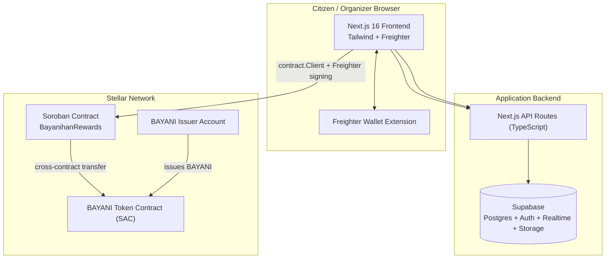
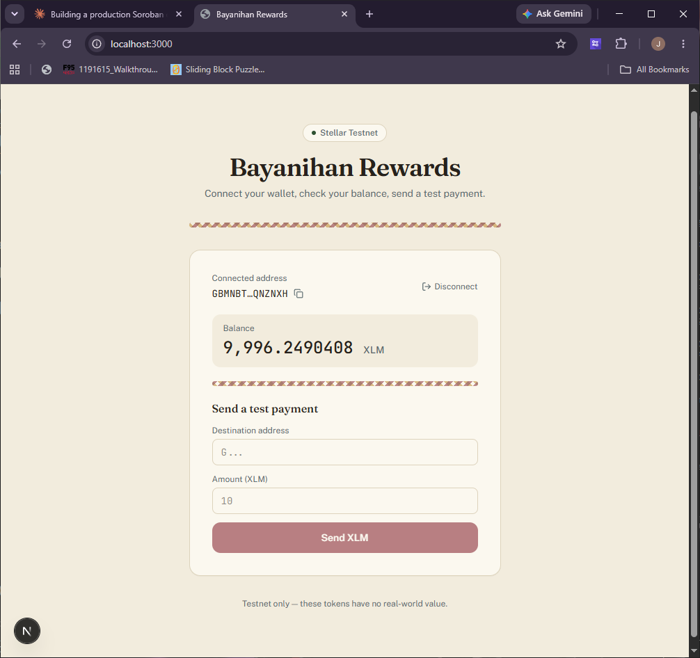
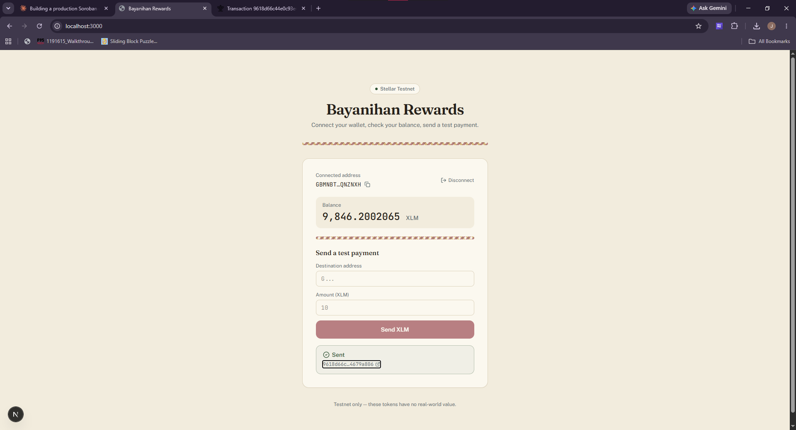
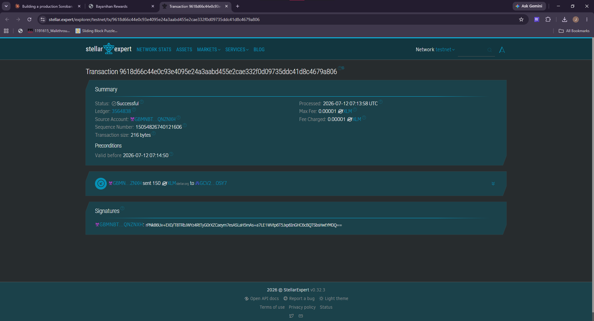

# Bayanihan Rewards

A transparent, on-chain incentive platform for Philippine communities, built on Stellar and Soroban. Local Government Units, schools, and NGOs run reward campaigns — attend a barangay seminar, join a clean-up drive, donate blood, complete TESDA training — and Soroban smart contracts handle verification and payout directly, instead of paper attendance sheets and manual disbursement.

## Problem

A resident of Marikina City attends a barangay disaster-preparedness seminar. There's no immediate incentive, because attendance and rewards are still tracked through paper forms and spreadsheets — manual, slow, and easy to dispute. Multiply that across every LGU program in the country and you get low participation, delayed payouts, and no public record of who actually got rewarded for what.

## Solution

Organizations create campaigns. Citizens join them. Organizers verify participation. A Soroban smart contract issues the reward the moment that verification happens — publicly, auditably, and in a wallet the citizen already controls. No spreadsheet in between, and no way to quietly skip someone.

## Status

This is a working, testnet-deployed system, not a mockup — but it's not a finished product either, and this README says so plainly rather than overclaiming:

| Piece | Status |
|---|---|
| Soroban contract (9 functions, 5 tests) | ✅ Deployed to Testnet, exercised end-to-end |
| Database schema + RLS | ✅ Deployed, verified against a real Postgres instance |
| Wallet connect / balance / send (XLM) | ✅ Working, browser-verified |
| Browse campaigns, join | ✅ Working |
| Organizer: verify + issue reward | ✅ Working |
| Citizen: claim reward, view BAYANI balance | ✅ Working |
| Campaign creation UI + organization registration | ✅ Working |
| Leaderboard, Analytics | ✅ Working |
| Dashboard | ⬜ Not started |
| Freighter-session-backed Supabase Auth | ⬜ Not started — see note below |
| CI/CD | ⬜ Not started |

**A known simplification, not a bug:** a few API routes (`/api/campaign/join`, `/api/campaign/verify`, `/api/rewards/claim`) trust whatever wallet address is passed in the request body, rather than a cryptographically-verified session. Fine for a testnet demo where the on-chain transaction is the real source of truth anyway; worth closing before this handles anything of value.

## Architecture



The frontend calls the deployed contract directly via `@stellar/stellar-sdk`'s `contract.Client`, with Freighter signing in the browser — the backend never builds or signs blockchain transactions itself. Its job is Supabase: fast campaign listing, and recording confirmed on-chain results for querying.

## Tech stack

- **Frontend:** Next.js 16, TypeScript, Tailwind CSS v4
- **Wallet:** Freighter (`@stellar/freighter-api`)
- **Blockchain:** Stellar Testnet, Soroban smart contracts (Rust), `@stellar/stellar-sdk`
- **Backend:** Supabase (Postgres, Auth, Realtime, Storage)

## Project structure

```
bayanihan-rewards/
├── app/                      # Next.js App Router pages + API routes
│   ├── campaigns/            # Browse + join campaigns
│   ├── organizer/            # Verify participants, issue rewards
│   ├── rewards/              # Claim rewards, view BAYANI balance
│   └── api/                  # campaigns, campaign/join, campaign/verify, rewards, rewards/claim
├── components/               # JoinCampaignButton, VerifyAndIssueButton, ClaimRewardButton
├── lib/
│   ├── wallet.ts              # Freighter integration
│   ├── stellar.ts             # Horizon: XLM balance, classic payments
│   ├── soroban.ts             # contract.Client wrapper, BAYANI decimal conversion
│   └── supabase/               # browser / server / admin clients
├── contracts/bayanihan-rewards/  # Soroban contract (Rust)
├── supabase/migrations/       # 4 migrations, applied in order
└── DEPLOYMENT.md              # Full contract deployment + CLI smoke-test guide
```

## Installation

```
npm install
```

Requires Node 22+. For the contract itself: Rust 1.84+ with the `wasm32v1-none` target, and the Stellar CLI (v27+) — see [DEPLOYMENT.md](./DEPLOYMENT.md) for the full setup.

## Environment variables

Copy `.env.local` (already populated with the live testnet values this project uses) or set these yourself:

```env
NEXT_PUBLIC_SUPABASE_URL=
NEXT_PUBLIC_SUPABASE_ANON_KEY=
SUPABASE_SERVICE_ROLE_KEY=

NEXT_PUBLIC_STELLAR_NETWORK=testnet
NEXT_PUBLIC_FREIGHTER_NETWORK=testnet

SOROBAN_RPC_URL=https://soroban-testnet.stellar.org
SOROBAN_CONTRACT_ID=
NEXT_PUBLIC_SOROBAN_RPC_URL=https://soroban-testnet.stellar.org
NEXT_PUBLIC_SOROBAN_CONTRACT_ID=

BAYANI_TOKEN_CONTRACT_ID=
NEXT_PUBLIC_BAYANI_TOKEN_CONTRACT_ID=
BAYANI_ISSUER_ADDRESS=
```

The `NEXT_PUBLIC_` versions of the Soroban values exist because `contract.Client` runs in the browser too — Freighter can only sign there.

## Supabase setup

1. Create a project at [supabase.com](https://supabase.com).
2. Run the four migrations in `supabase/migrations/`, in order, via the SQL editor or `supabase db push`. Migration `0003` seeds a real demo campaign; `0004` corrects a reward-amount scaling bug found during testing (see that file's comments — every Stellar asset uses 7 decimal places, non-configurable, and it's an easy one to miss).
3. Copy the project URL and both keys into `.env.local`.

## Stellar / Soroban setup

Full walkthrough — building the contract, deploying to Testnet, initializing it, and a complete CLI smoke test of the whole reward cycle — is in **[DEPLOYMENT.md](./DEPLOYMENT.md)**. Every command in it has been run for real, not just written from memory; several corrections in there exist specifically because a first guess at the CLI syntax turned out wrong.

## Testing

```
cd contracts/bayanihan-rewards
cargo test
```

Five tests: happy-path reward issuance, unauthorized verification, duplicate participation, campaign state, and reward balance verification (issue → claim → confirm balance, then confirm a second claim attempt is rejected).

## Deployment

- **Contract:** see DEPLOYMENT.md.
- **Frontend:** any Next.js host (Vercel is the natural fit) — set the environment variables above, then `npm run build`.

## Demo walkthrough

**Citizen journey:** connect Freighter → browse active campaigns at `/campaigns` → join → wait for the organizer to verify → claim the reward at `/rewards`, where the BAYANI balance updates live.

**Organizer journey:** connect Freighter at `/organizer` → see campaigns and who's joined → verify a participant and issue their reward in one action (two on-chain calls under the hood, one click in the UI).

Level 1's required screenshots, all from real testnet transactions:

**Wallet connected + balance**


**Successful transaction**


**Transaction result on a block explorer**


## Hackathon submission guide

- **Public repository:** push this project to GitHub (Supabase keys and the service role key belong in `.env.local`, which should stay gitignored — never commit them).
- **README:** this file.
- **Contract address:** see `.env.local`'s `SOROBAN_CONTRACT_ID`, or DEPLOYMENT.md.
- **Screenshots:** included above.
- **Commit history:** commit as you go rather than one large dump — Level 2's checklist specifically looks for meaningful history.

## License

MIT.
